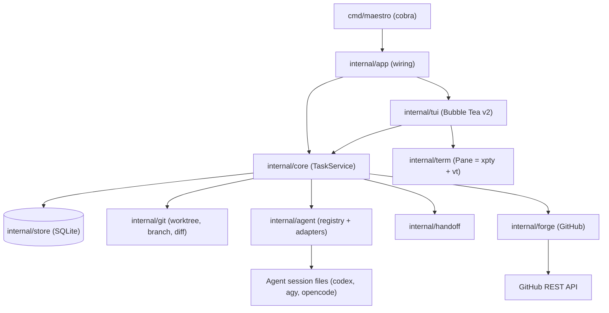
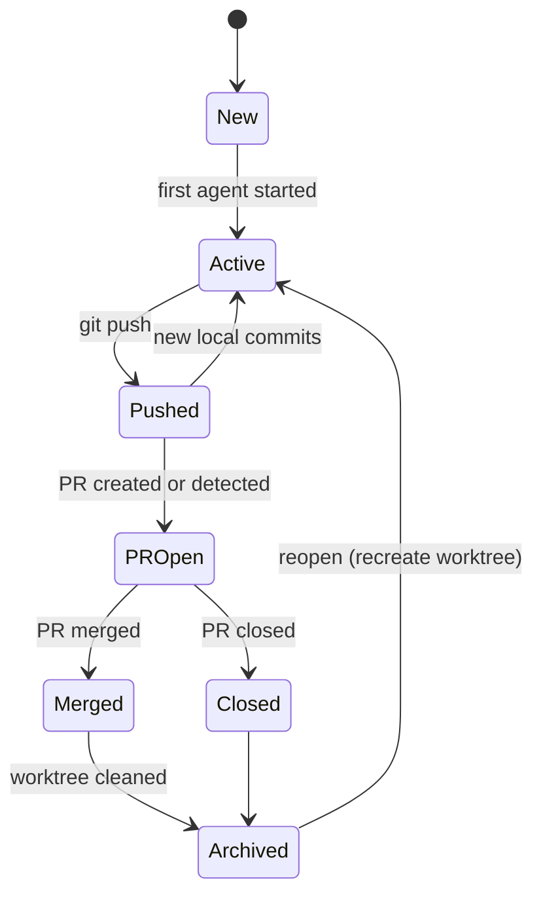
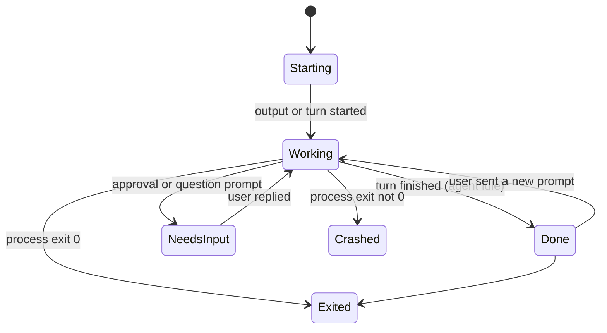
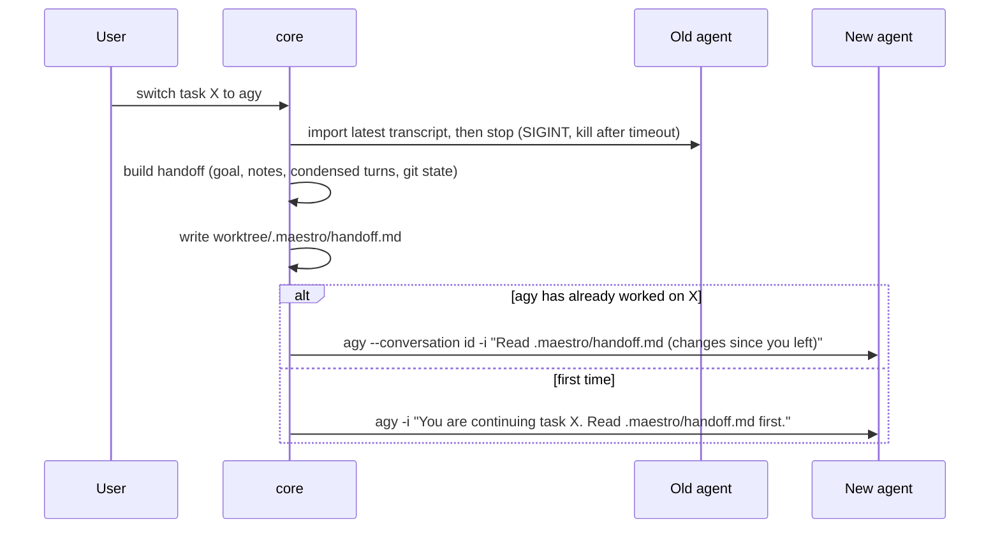
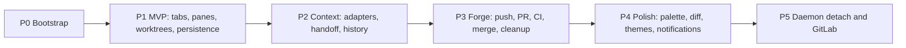

# Maestro: Implementation Plan

## Goal

**Maestro** is a cross-platform (Linux/macOS/Windows) CLI/TUI that works like **tmux for coding agents**. In a single repo you open tabs, and each tab is a **task**. A task runs an agent (codex, agy, opencode, or any CLI agent you configure) inside its own **git worktree + branch**. Each task eventually becomes a **PR**. Once the PR is merged, its worktree is deleted, but Maestro **keeps the task's history** (conversations, agent sessions, events). You can **switch agents within the same task** and the context carries over.

## Decisions

| Topic | Decision |
|---|---|
| Terminal hosting | Built-in terminal: Bubble Tea v2 + `charmbracelet/x/vt` + `charmbracelet/x/xpty` (PTY on Unix, ConPTY on Windows) |
| Persistence | No daemon in v1. On restart, Maestro reopens each agent's own session (resume by ID). Detach/attach comes in a later phase |
| Context transfer | Handoff brief: Maestro reads each agent's session logs into one task history and starts the next agent with a generated `.maestro/handoff.md` |
| Git host | GitHub first, behind a `forge.Provider` interface |
| Prefix key | `ctrl+m`, with automatic fallback to `ctrl+b` (see warning below) |
| Worktree location | `<xdg data>/maestro/worktrees/<repo>/<task>` |
| "Done" | A **runtime** state: the agent is idle because it has finished thinking and applying changes for its current turn |
| Icons | Nerd Font glyphs by default, with automatic Unicode/ASCII fallback |
| Merge method | `squash` by default |

> [!WARNING]
> **`ctrl+m` vs Enter.** In legacy terminal encoding, `ctrl+m` sends the same byte as Enter (`\r`). Maestro asks the terminal for keyboard enhancements (kitty protocol "disambiguate", or Windows `win32-input-mode`). Terminals that support this report `ctrl+m` as its own key:
> - Supported: kitty, Ghostty, WezTerm, foot, Alacritty, iTerm2 (CSI u), Windows Terminal.
> - Not supported: GNOME Terminal/VTE, macOS Terminal.app, tmux by default.
>
> If the terminal doesn't confirm support, Maestro switches to `prefix_fallback` (`ctrl+b`) and shows a one-time toast, so Enter is never captured. `maestro doctor` reports which prefix is in use.

> [!IMPORTANT]
> **Maestro reads each agent's private session files** (codex rollouts, agy transcripts, opencode exports) to build the task history. These formats are undocumented and may change. Each adapter is versioned and has a fallback: if parsing fails, Maestro captures the terminal's scrollback, strips the ANSI codes, and uses that instead.

> [!WARNING]
> `charmbracelet/x/vt` is experimental. It sits behind our own `term.Emulator` interface, so we can swap in `vt10x`/`bubbleterm` if it can't render agent TUIs correctly (alt screen, kitty keyboard protocol, synchronized output).

> [!CAUTION]
> Cleanup after merge deletes the worktree. Maestro **never** force-removes a worktree with uncommitted or unpushed work without an explicit confirmation. The default is `cleanup = "ask"`.

---

## Architecture



- **The TUI never touches git or the DB directly.** It calls `core.TaskService`, which emits events (`TaskUpdated`, `AgentActivity`, `PRStatusChanged`) as Bubble Tea messages.
- **Every git operation runs the system `git` binary** (not go-git). This respects your config, hooks, credential helpers and signing.
- **One TUI per project at a time**, enforced with a lock file (`flock` on Unix, `LockFileEx` on Windows). Read-only CLI commands still work while the TUI is open.

### Task model

Each task has two independent states: a **lifecycle** state (saved) and a **runtime** state (live, per tab).

**Lifecycle:**


**Runtime (per tab):**


**How "Done" is detected** (strongest signal wins):
1. **Turn-complete signal from the adapter:** a turn-complete or task-complete record appears in the agent's session log.
2. **Terminal notifications:** BEL / OSC 9 / OSC 777, which agents emit when a turn ends.
3. **Quiet timer:** no PTY output for `activity.idle_after` (default 2s) after a Working period.

**NeedsInput** is detected through adapter `Hints()` prompt patterns (e.g. "Allow command?", "Approve?").
**Done** only shows after a Working period, so a fresh, untouched agent shows as `Starting`/idle rather than "Done".

---

## Tech Stack

| Concern | Choice | Why |
|---|---|---|
| Language | Go 1.24 (existing `go.mod`) | Single static binary, easy cross-compilation |
| TUI | Bubble Tea v2, Lip Gloss v2, Bubbles v2, Huh (forms) | Modern rendering, keyboard enhancements, mouse |
| Terminal | `charmbracelet/x/vt` + `charmbracelet/x/xpty` | Same ecosystem; PTY + ConPTY |
| CLI | `spf13/cobra` | Subcommands, completions |
| Storage | `modernc.org/sqlite` (no cgo) + embedded SQL migrations | Cross-compiles with no C toolchain |
| Config | TOML (`pelletier/go-toml/v2`), paths via `adrg/xdg` | Correct per-OS directories |
| GitHub | `google/go-github` + ETag conditional requests | Keeps polling cheap on rate limits |
| File watch | `fsnotify` | Detects new agent sessions and turn completion |
| Release | goreleaser (6 OS/arch targets), Homebrew tap, Scoop | |
| Tests | `testing`, `teatest` golden files, `httptest`, fake-agent binary | |

---

## Proposed Changes

All files are new (the repo currently has only `go.mod`, `LICENSE`, `.gitignore`).

### Layout

```
cmd/maestro/main.go
internal/
  app/        app.go                         # dependency wiring, lock file
  config/     config.go, defaults.toml       # global + per-repo config
  store/      store.go, migrations/*.sql, tasks.go, sessions.go, events.go
  core/       service.go, lifecycle.go, events.go, poller.go
  git/        git.go, worktree.go, status.go
  agent/      agent.go, registry.go, generic.go, codex/, agy/, opencode/
  term/       emulator.go, pane.go, keys.go, activity.go
  handoff/    handoff.go, template.md.tmpl, budget.go
  forge/      forge.go, github/github.go
  tui/        model.go, keymap.go, theme.go, icons.go,
              tabs.go, statusbar.go, sidebar.go,
              dialogs/{newtask,switchagent,confirm,palette}.go,
              views/{history,diff,help}.go
  testutil/   fakeagent/main.go, gitrepo.go
docs/PLAN.md
.github/workflows/ci.yml
.goreleaser.yaml
README.md
```

---

### 1. Config: `internal/config`

#### [NEW] config.go
Settings are layered: built-in defaults < `~/.config/maestro/config.toml` < `<repo>/.maestro.toml` < CLI flags. **Agents are defined as data**, so you can add Gemini, Aider and others without writing any code. Built-in presets include Codex, agy, OpenCode, Claude Code, Qoder, Kimi Code and Cursor Agent. Built-in adapters only add transcript parsing, session discovery and turn-complete detection.

```toml
prefix = "ctrl+m"
prefix_fallback = "ctrl+b"  # used when the terminal can't tell ctrl+m from Enter
icons = "nerd"              # nerd | unicode | ascii (nerd falls back automatically)
theme = "auto"              # auto | dark | light | <custom>
default_agent = "codex"

[activity]
idle_after = "2s"           # quiet-timer fallback for "Done"
notify_on = ["done", "needs_input"]   # desktop notifications (when the tab is not focused)

[worktree]
root = ""                   # empty = <xdg data>/maestro/worktrees
branch_prefix = "maestro/"
copy = [".env", ".env.local"]   # files copied from the main checkout into each new worktree
setup = []                       # e.g. ["npm ci"], run once after the worktree is created

[git]
merge_method = "squash"     # squash | merge | rebase
cleanup = "ask"             # ask | auto | never

[agents.codex]
cmd = "codex"
new = ["{{if .Prompt}}{{.Prompt}}{{end}}"]
resume = ["resume", "{{.SessionID}}", "{{if .Prompt}}{{.Prompt}}{{end}}"]

[agents.agy]
cmd = "agy"
new = ["{{if .Prompt}}-i{{end}}", "{{.Prompt}}"]
resume = ["--conversation", "{{.SessionID}}", "{{if .Prompt}}-i{{end}}", "{{.Prompt}}"]

[agents.opencode]
cmd = "opencode"
new = ["{{if .Prompt}}--prompt{{end}}", "{{.Prompt}}"]
resume = ["--session", "{{.SessionID}}", "{{if .Prompt}}--prompt{{end}}", "{{.Prompt}}"]
```
(Arguments that render empty are dropped.)

The complete shipped presets are in [`internal/config/defaults.toml`](../internal/config/defaults.toml). Claude Code and Qoder use `generate_session_id` with `--session-id`; Cursor uses `session_create = ["create-chat"]` to allocate a native ID before interactive launch. Kimi Code discovers identity from `.kimi-code/sessions` metadata. Its preset uses `manual_prompt = true` because the CLI's `--prompt` runs non-interactively with automatic approvals; enter the first prompt in the pane. See the [README's agent table](../README.md#session-resume) for executable names and compatibility notes.

---

### 2. Storage: `internal/store`

#### [NEW] migrations/0001_init.sql
```sql
CREATE TABLE projects (id INTEGER PRIMARY KEY, root TEXT UNIQUE, remote TEXT, default_branch TEXT, created_at INTEGER);
CREATE TABLE tasks (
  id INTEGER PRIMARY KEY, project_id INTEGER REFERENCES projects,
  slug TEXT, title TEXT, goal TEXT, notes TEXT,
  branch TEXT, base_branch TEXT, worktree TEXT,
  lifecycle TEXT, tab_order INTEGER,
  pr_number INTEGER, pr_url TEXT, pr_state TEXT, ci_state TEXT, review_state TEXT,
  created_at INTEGER, updated_at INTEGER, archived_at INTEGER,
  UNIQUE(project_id, slug));
CREATE TABLE agent_sessions (
  id INTEGER PRIMARY KEY, task_id INTEGER REFERENCES tasks,
  agent TEXT, native_id TEXT, started_at INTEGER, ended_at INTEGER,
  exit_code INTEGER, handoff_from INTEGER REFERENCES agent_sessions);
CREATE TABLE turns (                         -- normalized conversation history
  id INTEGER PRIMARY KEY, session_id INTEGER REFERENCES agent_sessions,
  seq INTEGER, role TEXT, content TEXT, ts INTEGER, UNIQUE(session_id, seq));
CREATE TABLE events (                        -- task timeline
  id INTEGER PRIMARY KEY, task_id INTEGER REFERENCES tasks,
  ts INTEGER, kind TEXT, payload TEXT);      -- created|agent_started|turn_done|switched|pushed|pr_opened|merged|cleaned|reopened
```
The DB lives at `<xdg data>/maestro/maestro.db` (Linux: `~/.local/share`, macOS: `~/Library/Application Support`, Windows: `%LOCALAPPDATA%`). It uses WAL mode with a single writer.

---

### 3. Git: `internal/git`

#### [NEW] worktree.go, status.go
- `CreateWorktree(repo, slug, base)`:
  1. Runs `git worktree add -b maestro/<slug> <data>/maestro/worktrees/<repo>/<slug> <base>`.
  2. Copies the files listed in `worktree.copy`.
  3. Runs the `setup` commands.
  4. Adds `.maestro/` to `$GIT_COMMON_DIR/info/exclude`.
- `RemoveWorktree(task, force)`: first checks for a dirty tree, unpushed commits and running processes. Then runs `git worktree remove`, `git branch -d`, and `git worktree prune`.
- `Status(worktree)`: dirty file count, `+adds −dels`, ahead/behind vs upstream, commits on the branch. Cached and refreshed on fsnotify events, after each "Done" turn, or every 5s.
- `RecreateWorktree(task)`, used on reopen: starts from the branch if it still exists, otherwise from the merge commit.

---

### 4. Agents: `internal/agent`

#### [NEW] agent.go
```go
type Agent interface {
    ID() string
    Detect(ctx context.Context) (Info, error)                 // path, version, ok
    Command(spec LaunchSpec) (*exec.Cmd, error)                // new or resume, optional first prompt
    DiscoverSession(ctx context.Context, dir string, since time.Time) (nativeID string, err error)
    Transcript(ctx context.Context, nativeID string) ([]Turn, error)
    WatchTurns(ctx context.Context, nativeID string) (<-chan TurnEvent, error) // started / done, used for the "Done" state
    Hints() ActivityHints                                      // prompt patterns that mean NeedsInput
}
type LaunchSpec struct{ Dir, SessionID, Prompt string; Env []string }
type Turn struct{ Role, Content string; TS time.Time }
```
`generic.go` implements `Agent` straight from the TOML config. It has no transcript parsing or turn events, so it falls back to scrollback capture and the quiet timer. Built-in adapters embed `generic` and add the agent-specific parts:

| Agent | Resume | Where history comes from | How the session ID is found |
|---|---|---|---|
| codex | `codex resume <id> [prompt]` (verified locally) | `$CODEX_HOME/sessions/**/rollout-*.jsonl` | New rollout file whose `session_meta.cwd == worktree` |
| agy | `agy --conversation <id>`, `-i <prompt>` (verified locally) | `~/.gemini/antigravity-cli/brain/<id>/.system_generated/logs/transcript.jsonl` | New conversation dir created after launch whose workspace matches |
| opencode | `opencode --session <id> --prompt` | `opencode export <id>` (JSON) | `opencode session list`, filtered by directory |

Session discovery works because **each task has a unique worktree path**. Matching on cwd/workspace stays reliable even when several tabs run the same agent. Transcripts are re-imported (incrementally, by `seq`) after every "Done" turn, when the agent exits, and when you switch agents.

> [!NOTE]
> P2 parsers have fixture coverage and read-only checks against locally available native transcripts/exports. Authenticated live cross-agent conversations remain a manual acceptance check.

---

### 5. Terminal panes: `internal/term`

#### [NEW] emulator.go, pane.go, keys.go, activity.go
```go
type Emulator interface {            // wraps x/vt so the backend can be swapped
    Write(p []byte) (int, error)
    Resize(cols, rows int)
    Render() string                  // styled cell grid for the View
    Cursor() (x, y int, visible bool)
    Scrollback() []string
    Title() string
    KeyboardMode() KeyboardMode      // legacy vs kitty flags the agent asked for
}
type Pane struct {
    pty  xpty.Pty; emu Emulator; cmd *exec.Cmd
    activity *Activity               // runtime state machine: Working/Done/NeedsInput...
}
```
- **Output:** one reader goroutine per pane reads the PTY and feeds `emu.Write`. It then sends a throttled `PaneDirtyMsg` (redraws capped at ~60 fps).
- **Background panes** keep parsing output, and keep updating their activity state, but are only rendered when they're the active tab.
- **Input:** `keys.go` turns Bubble Tea key events back into byte sequences using the encoding the **agent** asked for (legacy or kitty), including bracketed paste and mouse passthrough. Everything goes to the active pane except the prefix key and the reserved `alt+` shortcuts. Plain Enter is always forwarded as `\r`.
- **Prefix fallback:** at startup Maestro requests keyboard enhancements. If the terminal doesn't confirm support, the active prefix becomes `prefix_fallback`.
- **Scroll mode** (`prefix [`): scroll back through history and copy with vim keys.
- **Resizing:** a terminal resize is forwarded to every pane (`pty.Resize` + `emu.Resize`).

---

### 6. Context handoff: `internal/handoff`

#### [NEW] handoff.go, template.md.tmpl, budget.go
When you switch agents in a task (`prefix a`):


If the old agent is still Working, Maestro asks you to confirm before interrupting it.

The handoff file contains:
- the task goal and your notes;
- a timeline of the agents that worked on the task;
- the **condensed conversation**: the most recent turns verbatim, older turns trimmed so the whole thing fits a configurable token budget (default ~6k);
- git state: `git log base..HEAD --oneline`, `diff --stat`, uncommitted files;
- open TODOs.

**Optional smart summary:** with `handoff.summarizer = "codex"`, the outgoing agent first writes a summary non-interactively (`codex exec`, `agy -p`, `opencode run`). Off by default.

All history stays in SQLite, so it **survives worktree deletion**. On archive, a copy of each handoff file is saved to `<data>/maestro/archive/<repo>/<task>/`.

---

### 7. Git host: `internal/forge`

#### [NEW] forge.go, github/github.go
```go
type Provider interface {
    PRForBranch(ctx context.Context, repo Repo, branch string) (*PR, error) // state, checks, review, mergeable
    CreatePR(ctx context.Context, repo Repo, in NewPR) (*PR, error)
    Merge(ctx context.Context, repo Repo, number int, method string) error  // default "squash"
    WebURL(pr *PR) string
}
```
- **Auth token**, first found wins: `GH_TOKEN` / `GITHUB_TOKEN`, then `gh auth token` (if `gh` is installed), then config.
- **Polling:** `core/poller.go` polls open-task PRs every 60s using ETags. Changes become lifecycle transitions.
- **When a PR is merged:** a toast appears, followed by the cleanup flow (ask/auto/never).
- **PR body:** generated from the task goal, the handoff summary and the commit list. You can edit it before submitting.

---

### 8. TUI: `internal/tui`

#### [NEW] model.go, tabs.go, statusbar.go, sidebar.go, theme.go, icons.go, dialogs/*, views/*

**Main screen (top-tabs layout; `prefix s` switches to a sidebar layout):**
```
 ♪ maestro  ~/Projects/maestro                                      main  ✓ synced
 ⠹ fix-auth  codex │  add-tui  agy │  refactor  codex │  #42 docs  oc │  ci-cache │ +
╭──────────────────────────────────────────────────────────────────────────────────────╮
│                                                                                      │
│                        embedded agent terminal (active tab)                          │
│                                                                                      │
╰──────────────────────────────────────────────────────────────────────────────────────╯
 codex · maestro/fix-auth · +120 −14 · 3 files · ↑2 unpushed · no PR      ctrl+m ? help
```

**Status icons.** Each tab shows a **runtime glyph** (what the agent is doing) and a **lifecycle glyph** (where the PR stands), then the task name and an agent badge.

| Kind | Meaning | Nerd | Fallback | Colour |
|---|---|---|---|---|
| runtime | Starting / no activity yet | `` | `○` | dim |
| runtime | Working (thinking or applying changes) | spinner `⠋⠙⠹…` | `⠋⠙⠹…` / `-\|/` | accent |
| runtime | **Done** (agent idle, turn finished) | `` | `✓` | green |
| runtime | Needs your input (tab pulses, desktop notification) | `` | `⚑` | yellow |
| runtime | Exited / crashed | `` / `` | `■` / `⚠` | dim / red |
| lifecycle | Local changes, not pushed | `` | `●` | neutral |
| lifecycle | Pushed | `` | `↑` | blue |
| lifecycle | PR open (+ CI dot green/yellow/red) | ` #42` | `⇡#42` | blue |
| lifecycle | Changes requested | `` | `✎` | orange |
| lifecycle | Merged | `` | `⊕` | purple |
| lifecycle | Closed | `` | `✕` | red |

Icon mode is `nerd` by default. Maestro falls back to Unicode automatically when `icons = "nerd"` but the terminal reports a non-Nerd font (probe glyph width at startup), or when overridden. ASCII is available for minimal terminals.

The active tab is highlighted with a rounded underline, inactive tabs are dimmed, and the list scrolls with `‹ ›` when there are too many tabs. When a background tab turns **Done** or **NeedsInput**, its icon flashes once and a toast names it.

**Dialogs and views** (centered rounded modals with a dimmed backdrop):
- **New task** (`prefix c`): title → slug, base branch, agent picker showing detected agents, optional first prompt.
- **Switch agent** (`prefix a`): agent list showing which agents have previously worked on this task.
- **Command palette** (`prefix :`): fuzzy search over every action and task.
- **History** (`prefix h`): the task timeline (events + agent sessions); expand any session to read its turns.
- **Diff** (`prefix d`): syntax-highlighted `git diff` against the base branch.
- **Help** (`prefix ?`): all keybindings, grouped.
- **Toasts** in the bottom-right for async events (agent done, PR merged, CI failed, agent exited).

**Keymap** (prefix `ctrl+m`, falls back to `ctrl+b`; both configurable):

| Key | Action | Key | Action |
|---|---|---|---|
| `alt+1..9` | Go to tab N | `prefix c` | New task |
| `alt+h` / `alt+l` | Previous / next tab | `prefix a` | Switch agent |
| `prefix x` | Stop agent | `prefix r` | Restart / resume agent |
| `prefix p` | Push | `prefix P` | Create / open PR |
| `prefix m` | Merge PR (squash) | `prefix n` | Edit task notes |
| `prefix [` | Scroll / copy mode | `prefix ,` | Rename task |
| `prefix &` | Archive task | `prefix q` | Quit (agents stop; resumed next launch) |
| `prefix z` | Suspend app | `prefix s` | Toggle tabs / sidebar layout |
| `prefix t` | Open shell in task directory | `prefix prefix` | Send the prefix key itself to the agent |

Mouse: click a tab to switch, wheel scrolls back, drag a tab to reorder. Themes: built-in `auto` (detects dark/light), Catppuccin and Tokyo Night palettes, plus user-defined themes.

---

### 9. CLI: `cmd/maestro`

#### [NEW] main.go
```
maestro                         open the TUI for the current repo (restores tabs and resumes agents)
maestro new <title> [-a codex] [-b main] [-p "prompt"]
maestro ls [--all] [--json]     tasks with status icons
maestro open <task>             open the TUI focused on <task>
maestro switch <task> -a agy
maestro push|pr|merge <task>
maestro archive|reopen|rm <task>
maestro history <task> [--json] timeline + transcript
maestro notes <task> [--set TEXT | --file PATH|-]
maestro doctor                  agents and versions, git, GitHub auth, keyboard enhancements (active prefix), Nerd Font
maestro config [edit|path]
maestro completion <shell>
```

---

## Roadmap

### Implementation status

P0, P1, P2, and the P3 implementation are delivered. Authenticated live GitHub acceptance remains a manual check. P1 includes:

- Layered TOML defaults/global/repo configuration, validation, and per-task CLI overrides.
- SQLite migration with WAL and foreign keys; project/task/session persistence, atomic creation/start events, exit status and terminal fallback history.
- Main/linked-worktree project identity, collision-resistant data paths, branch/worktree creation, stable commit bases for relative revisions such as `HEAD`, safe file copies, setup commands and shared handoff exclusion.
- Generic agent detection and shell-free new/resume argument rendering; generated IDs and session-ID files for custom agents, plus minimal native identity discovery for Codex, agy and OpenCode.
- PTY/ConPTY panes behind an emulator interface, ANSI/alternate-screen rendering, keyboard negotiation and kitty/legacy forwarding, bracketed paste, mouse passthrough with negotiated wheel routing and explicit Maestro scroll mode, resize and bounded scrollback.
- Tabs, status bar, agent picker/new-task dialog, help, scroll/copy mode, activity icons, background notifications and periodic Git status refresh.
- TUI lifetime locking, launch/stop/restart, three-tab restoration by native session ID, graceful stop with process-tree cleanup, and explicit fresh-start recovery when resume metadata is missing.
- Functional root/open/new/ls/config/config-path/doctor commands; interactive doctor keyboard negotiation and agent-version checks.
- Tests for the foundation, real PTY processes, keyboard encoding, session identity matching, three-task stop/reopen/resume and UI snapshots at 80×24 and 160×48.

Implementation adjustments: minimal native session **identity** discovery was brought forward from P2 to satisfy P1 resume; full transcript adapters remain P2. `new` provisions tasks for scripts, while root/open and the TUI dialog launch agents. Nerd Font availability cannot reliably be inferred from glyph width, so the default conservatively falls back to Unicode. GitHub auth probes, PR workflows, polling, merge, cleanup, archive, and reopen are implemented in P3.

The dependency versions already selected in `go.mod` require Go 1.26, superseding the original Go 1.24 stack entry above.

Verification includes race-enabled tests, vet, lint with golangci-lint v2.9.0, module tidiness and Linux/Windows/macOS builds. A Linux terminal smoke test exercised three tabs, Working → Done, NeedsInput, creating a fourth task through the dialog, listing while locked, quitting and reopening with the same native IDs, fallback prefix, and simulated enhanced-keyboard replies. Native Windows/macOS execution and authenticated real-agent conversations remain manual verification items. CI now pins a Go 1.26-compatible linter.

P2 implementation includes:

- A configured-agent registry with versioned Codex, agy and OpenCode transcript parsers; filesystem watching and periodic export reconciliation, malformed-format fallback, and synthetic fixtures. OpenCode additionally supports its observed SQLite schema in strictly read-only mode when the CLI produces no usable JSON.
- SQLite migration v2 separating native conversation identity from process launches, source-key transcript upserts, consistent history snapshots, persisted handoffs and agent-specific resume lookup. Existing P1 terminal history is retained.
- Native turn activity precedence, including interrupted events for completed OpenCode cancellations/errors, per-task operation serialization, stale-pane event filtering, final history flush on stop, and pending-handoff recovery after launch/write failure.
- Pending handoffs also survive early startup crashes; delivery is acknowledged by a new native turn, clean exit, or an active pane surviving a two-second startup window for generic agents without native turn adapters.
- Switch retries regenerate pending briefs from current notes, saved history and Git state. Fresh replacements receive a new handoff after the outgoing agent's final output is saved, even when its clean exit acknowledges the earlier brief.
- Multiline task notes through `prefix n` (Ctrl+S save, Esc cancel) and `maestro notes` (`--set` / `--file`, including stdin), with locked writes, timeline events, and inclusion in subsequent handoffs.
- Deterministic budgeted handoffs including goal, notes, recent conversation, explicit TODO mentions and Git state. `[handoff] token_budget` defaults to 6000; the conservative estimator counts one UTF-8 byte per token. Smart summarization is deferred.
- `prefix a` switch/confirmation dialog, `prefix h` expandable history with selected sessions kept visible during navigation, `prefix H` manual-prompt handoff copy, `maestro history [--json]`, and `maestro switch <task> -a <agent>` opening the focused TUI under the existing project lock.
- Fixture/parser tests; P1 migration and transcript ownership tests; handoff budget/symlink tests; a fake-agent Codex → agy → Codex integration test; failure recovery and concurrent lifecycle tests; history retention after deleting the worktree/source logs and reopening the database; CLI history while locked; and switch/history snapshots at both viewport sizes.

P2 verification separates automated fixture/PTY tests and read-only local parser compatibility checks from authenticated live conversations. The latter, along with native Windows/macOS terminal execution, remain manual checks. P3 provides archive/reopen and handoff-file archival; SQLite retains the handoff contents.

P3 implementation includes:

- A GitHub provider behind `forge.Provider`, with HTTPS/SSH remote parsing, token precedence (`GH_TOKEN`, `GITHUB_TOKEN`, `gh auth token`, config), ETag-backed GET caching, pagination, rate-limit backoff, PR creation/lookup, CI/check aggregation, review state, and expected-head squash/merge protection.
- Push, PR, merge, refresh, and cleanup operations shared by the CLI, TUI, and runtime poller. PR descriptions include the goal, notes, latest handoff, and commit list; lifecycle, CI, and review fields persist with timeline events.
- A sixty-second poller for open PRs, background cleanup notifications, configurable `ask`/`auto`/`never` cleanup, dirty and unpushed-work refusal, worktree/branch ownership validation, and explicit force cleanup confirmation.
- Durable cleanup recovery: archive handoffs under the data directory, preserve immutable `refs/maestro/recovery/<task-id>/<commit>` snapshots alongside the latest `refs/maestro/archive/<task-id>` pointer, retain the merge commit for squash merges, resume interrupted cleanup, and recreate archived worktrees from their branch or saved commit. Newly recreated worktrees restore configured copies and setup with persisted progress before activation. SQLite history survives worktree and branch deletion.
- Explicitly empty PR descriptions remain empty across CLI flags/files and the TUI editor. Persisted lifecycle events wait for consumption when the UI event buffer fills and unblock on runtime shutdown.
- Regression coverage includes two cleanup cycles followed by Git garbage collection, failed/retried provisioning, a saturated event buffer during automatic cleanup, and the complete TUI push → PR → merge → archive workflow with retained history.
- TUI controls for push, PR editing, merge confirmation, cleanup/reopen dialogs, lifecycle badges, CI/review indicators, PR browser/copy actions, and viewport snapshots; CLI flags for PR title/body/base, expected merge head, cleanup, and force confirmation.

P1/P2 regression coverage also includes blocked raw-PTY input and bounded shutdown,
alternate-screen teardown and resized scrollback capture, startup-crash handoff
recovery across database reopening, and notes persistence, locking, handoff inclusion,
and editor snapshots. Pane input is queued separately from PTY writes; a 16 MiB
pending-input limit reports an error and requires restarting the agent instead of
blocking the UI or growing memory without a bound.



| Phase | Deliverables | Exit criteria |
|---|---|---|
| **P0** | Repo layout, cobra skeleton, CI matrix (linux/macos/windows), golangci-lint, goreleaser | `go build`/`go test` green on all 3 OSes |
| **P1** | config, store, git worktrees, generic agents, `term.Pane`, tab bar + status bar + new-task dialog, runtime icons (quiet-timer "Done"), prefix detection + fallback, restore + resume on restart, lock file | Run 3 agents in 3 tabs on 1 repo; icons go Working → Done; quit and relaunch; all tabs and sessions come back |
| **P2** | codex/agy/opencode adapters (session discovery, transcripts, turn-complete events), handoff, switch-agent dialog, history view, `maestro history` | codex → agy → codex in one task with context visibly carried over; accurate "Done" from turn events; history survives a worktree delete |
| **P3** | GitHub provider, push / PR / squash-merge, poller, CI and review badges, cleanup flow, archive/reopen | A task goes New → PR → Merged → Archived from inside the TUI, and the icons update |
| **P4** | Command palette, diff view, sidebar layout, themes, mouse drag, desktop notifications, custom agents docs | UX review pass; teatest golden files for every screen |
| **P5** | `maestrod` (Unix socket / Windows named pipe) for detach/attach, GitLab provider | Agents keep running after the TUI closes |

---

## Verification Plan

### Automated Tests
```bash
go vet ./... && golangci-lint run
go test -race ./...                       # every package
go test ./internal/tui/... -update        # regenerate teatest golden files (review the diff)
```
- **store:** migrations up from empty; CRUD; history kept after a task is archived.
- **git:** temp repos from `testutil/gitrepo.go`. Covers create/remove worktree, dirty-tree refusal, status counts, and reopen from a merged branch.
- **agent adapters:** parse fixture transcripts in `testdata/` (codex rollout, agy transcript, opencode export). Covers turn-complete events, session discovery with fake files, and command rendering for new/resume with and without a prompt.
- **term:** spawns `testutil/fakeagent`, which prints ANSI and the alt screen, works for N seconds, rings BEL, waits for input, then exits. Checks:
  - render output;
  - runtime transitions Starting → Working → Done → NeedsInput → Exited;
  - resize;
  - key encoding: legacy vs kitty, and Enter vs `ctrl+m`;
  - prefix fallback when enhancements are unsupported.
- **handoff:** golden output, and that the token budget is respected.
- **forge:** `httptest` fake GitHub (PR lookup with ETag/304, create, squash merge, checks).
- **tui:** `teatest` golden snapshots for the main screen, every icon state (Nerd + Unicode), and every dialog, at 80×24 and 160×48.
- **CI:** GitHub Actions on ubuntu, macOS and windows.

### Manual Verification
1. In a real repo, run `maestro` and create 3 tasks with codex, agy and opencode. Typing, colours, resize and scroll mode should all behave correctly. Enter must always reach the agent.
2. Check the prefix:
   - In Ghostty/kitty/WezTerm, `ctrl+m` should act as the prefix.
   - In GNOME Terminal or tmux, Maestro should switch to `ctrl+b` and show a toast saying so.
3. Give an agent a prompt. The tab should spin while it works, turn to **Done** when it finishes, and go to needs-input when an approval prompt appears.
4. `prefix q`, then relaunch: tabs come back and each agent resumes its own session.
5. Switch codex → agy in one task: agy should summarise the earlier work without being told again.
6. Push and open a PR from the TUI, squash-merge it, and watch the tab go to merged and then to the cleanup prompt. `maestro history <task>` should still show the whole conversation.
7. Repeat steps 1–4 on Windows Terminal and on macOS iTerm/Ghostty.

## Risks & Mitigations

| Risk | Mitigation |
|---|---|
| `ctrl+m` is the same byte as Enter on legacy terminals | Keyboard-enhancement detection, automatic `ctrl+b` fallback, `doctor` report |
| Rendering bugs with complex agent TUIs | `Emulator` interface; real-agent smoke tests; can fall back to another backend |
| "Done" detection is wrong (false idle during long tool runs) | Adapter turn events first; quiet timer only as a fallback; `idle_after` configurable |
| Key conflicts with agents | Configurable prefix; `prefix prefix` passthrough; prefix-free shortcuts limited to `alt+` |
| Agent session formats change | Versioned adapters plus fixture tests; scrollback-capture fallback |
| Windows ConPTY quirks | CI on Windows; `xpty` abstraction; tested in Windows Terminal |
| Losing work during cleanup | Dirty/unpushed checks; `ask` by default; never force without confirmation |
| GitHub rate limits | ETag requests; poll only open-task PRs; back off on 403 |
